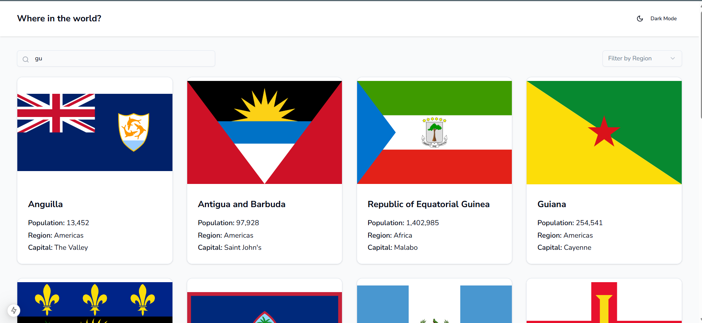
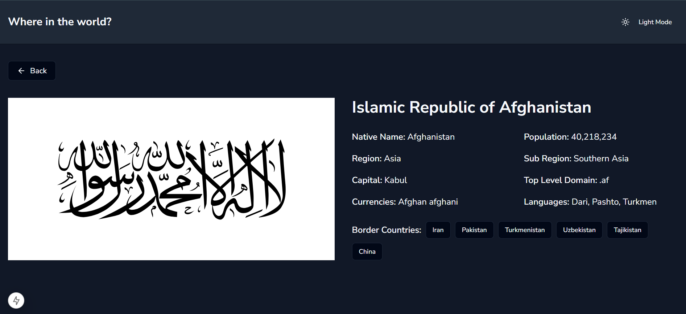
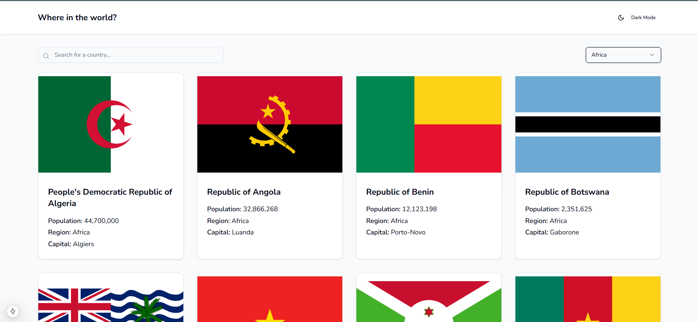
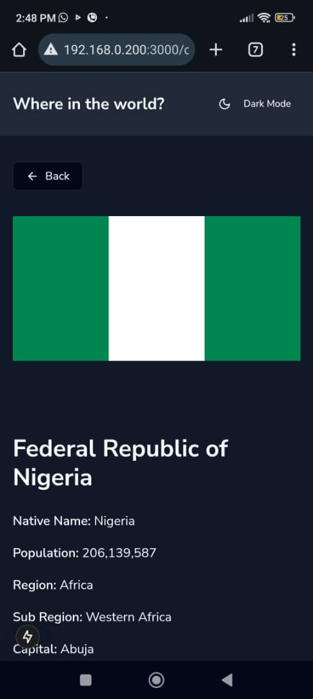

# EBO FE Test Submission

This is a solution to the EBO Front-end Engineering Technical Test

## Table of contents

- [Overview](#overview)
  - [The challenge](#the-challenge)
  - [Screenshot](#screenshot)
  - [Links](#links)
- [My process](#my-process)
  - [Built with](#built-with)
  - [Getting Started](#getting-started)
- [Author](#author)

## Overview

### The challenge

The challenge is to integrate with the https://restcountries.com to pull country data and display it, showcasing skills in front-end development using NextJS.

Users should be able to:

- See all countries from the API on the homepage
- Search for a country using an `input` field
- Filter countries by region
- Click on a country to see more detailed information on a separate page
- Click through to the border countries on the detail page
- Toggle the color scheme between light and dark mode *(optional)*

### Screenshot

- Searching for countries



###
- Country Details



###
- Filtering by region



###
- Mobile view




### Links

- Live Site URL: (https://countries-andemosa.vercel.app/)

## My process

### Built with

- TypeScript
- [Next.js](https://nextjs.org/)
- [Tailwind](https://tailwindcss.com/)
- [ShadcnUI](https://ui.shadcn.com/)

## Getting Started

This is a [Next.js](https://nextjs.org/) project bootstrapped with [`create-next-app`](https://github.com/vercel/next.js/tree/canary/packages/create-next-app).

First, run the development server:

```bash
npm run dev
# or
yarn dev
# or
pnpm dev
# or
bun dev
```

Open [http://localhost:3000](http://localhost:3000) with your browser to see the result.

You can start editing the page by modifying `app/page.tsx`. The page auto-updates as you edit the file.

This project uses [`next/font`](https://nextjs.org/docs/basic-features/font-optimization) to automatically optimize and load Inter, a custom Google Font.


## Author

- Anderson Osayerie - [@andemosa](https://andemosa.tech)
- Twitter - [@andemosa](https://www.twitter.com/andemosa)
